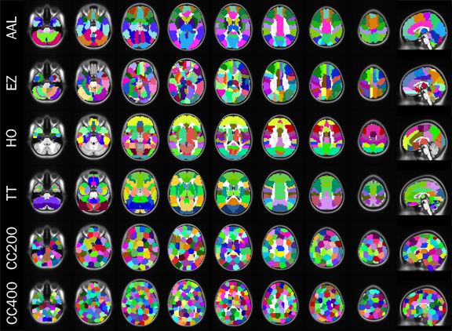
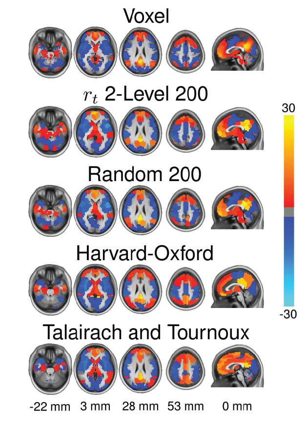
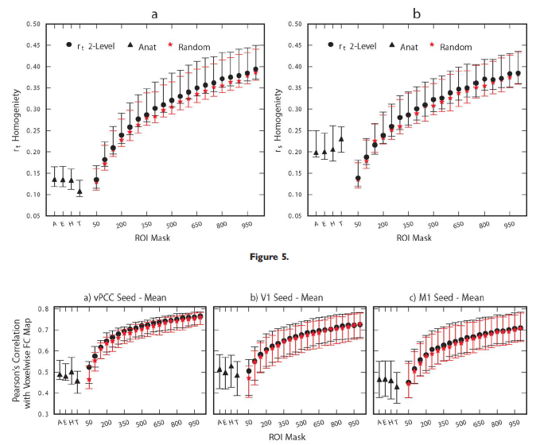
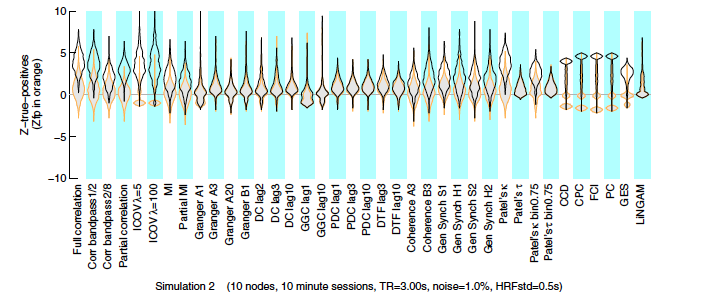
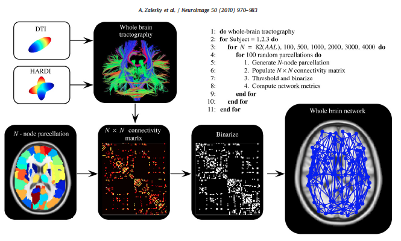
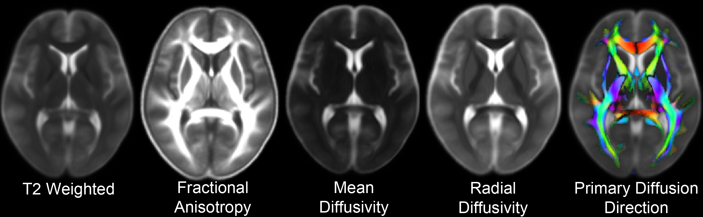

% Lecture #3: Mapping structural connectivity in the connectome with DTI
% R. Cameron Craddock, PhD
  Research Scientist VI, Nathan S. Kline Institute for Psychiatric Research, New York, NY
  Director of Imaging, Child Mind Institute, New York, NY
% July 30, 2014

---

# Leftover from fMRI lecture

- Constructing *brain areas* (Regions of Interests, ROIs) using clustering algorithms
- Measuring functional interactions between brain areas

---

# Brain Areas

<figure><figcaption><small>Different atlases for defining connectome nodes. Craddock et al., Nature Methods, 2013</small></figcaption></figure>

- To construct a *connectome graph*, you must first choose the areas to use as *graph nodes*
- Voxels are a logical choice, but will result in very large connectomes
- Alternatives are to use brain atlases derived from cytoarchitectonics, cortical landmarks, or from clustering data

---

# Brain Areas

<figure><figcaption><small>Different atlases provide different FC results. Craddock et al., Human Brain Mapping, 2011</small></figcaption></figure>

- Anatomical atlases provide good *interpretability* but may not accurately fit brain function
- Best to derive brain areas from the data (can be done with functional and structural data)

--- 

# Clustering Brain Data

1. Preprocess the data
2. Construct *affinity matrix* for each dataset
    - $N_{vox} \times N_{vox}$ matrix where each entry corresponds to the similarity of the voxel's time course (fMRI), or connectivity pattern (fMRI or dMRI)
    - Constrain connectivity to just neighboring voxels
3. Cluster individual data
    - Several different clustering algorithms can be used
4. Combine clustering solution across datasets
    - Create affinity matrix for each clustering solution, where similarity is 1 if two voxels are in the same cluster, and 0 otherwise
    - Average affinity matrices across datasets
5. Perform group level clustering
6. Determine optimal number of clusters
    - Calculate clustering solutions with different numbers of clusters
    - Compare solutions to find the best
    
---

# Finding the optimal number of clusters

- Distortion index, silhouette, leave-one-out cross validation, representational accuracy
- No clear best solution, instead there is a continuum of solutions to choose from

<figure><figcaption><small>Evaluation of different clustering solutions. Craddock et al., Human Brain Mapping, 2011</small></figcaption></figure>

--- 

# Creating Edges

- Function interactions are typically measured using **Pearson's correlation**, although many other methods have been proposed $$\rho(v_i,v_j)=\frac{1}{T-1}\sum\limits_{t=0}^{T}\frac{(v_{i}[t]-\mu_{i})(v_{j}[t]-\mu_{j})}{\sigma_{i}\sigma_{j}}$$
    - $v_i[t]$ and $v_j[t]$ are the time courses for the $i^{th}$ and $j^{th}$ brain areas, respectively
    - $T$ is the number of samples in a time course
    - $\mu_i$ and $\mu_j$ are the means of the $i^{th}$ and $j^{th}$ brain areas
    - $\sigma_i$ and $\sigma_j$ are the standard deviations of the $i^{th}$ and $j^{th}$ brain areas

----

# Other Methods

<figure><figcaption><small>Comparison of different methods for calculating functional relationships. Smith et al., NeuroImage, 2011</small></figcaption></figure>

---

# DTI Connectomes Overview

<figure><figcaption><small>Zalesky et al., NeuroImage, 2010</small></figcaption></figure>

--- 

# Diffusion Tensor Imaging

---

# Diffusion MRI

- [Brian Wandell PhD' Diffusion Tutorial from NIPS](http://white.stanford.edu/~brian/papers/mri/2006-Wandell-NIPS-Tutorial.pdf)